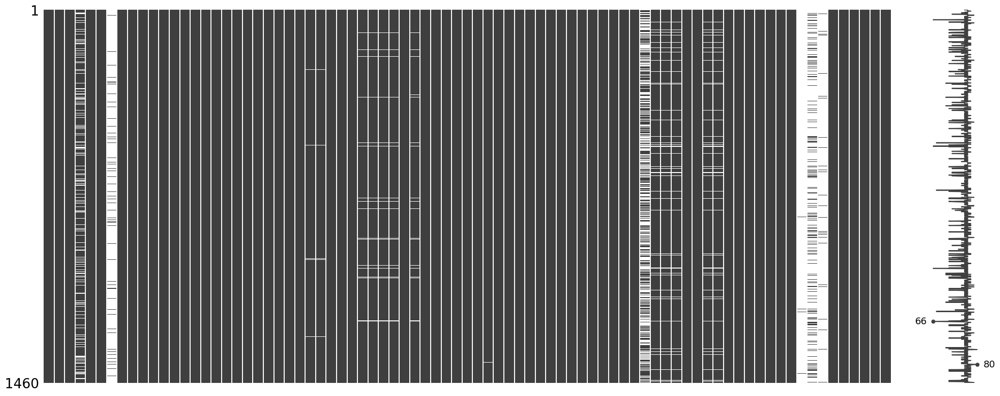
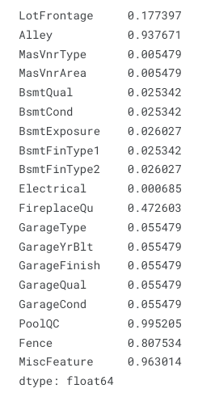
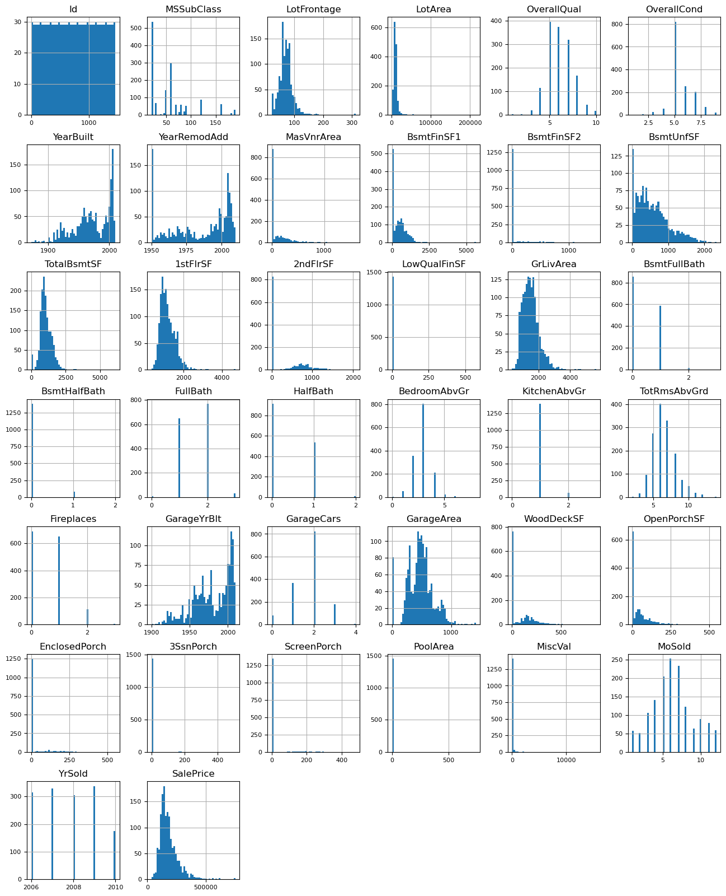
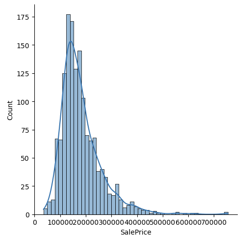
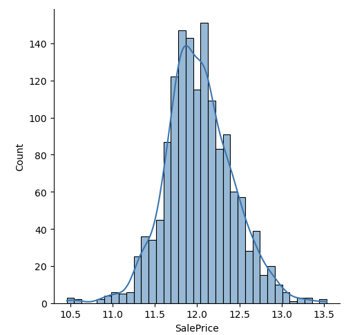
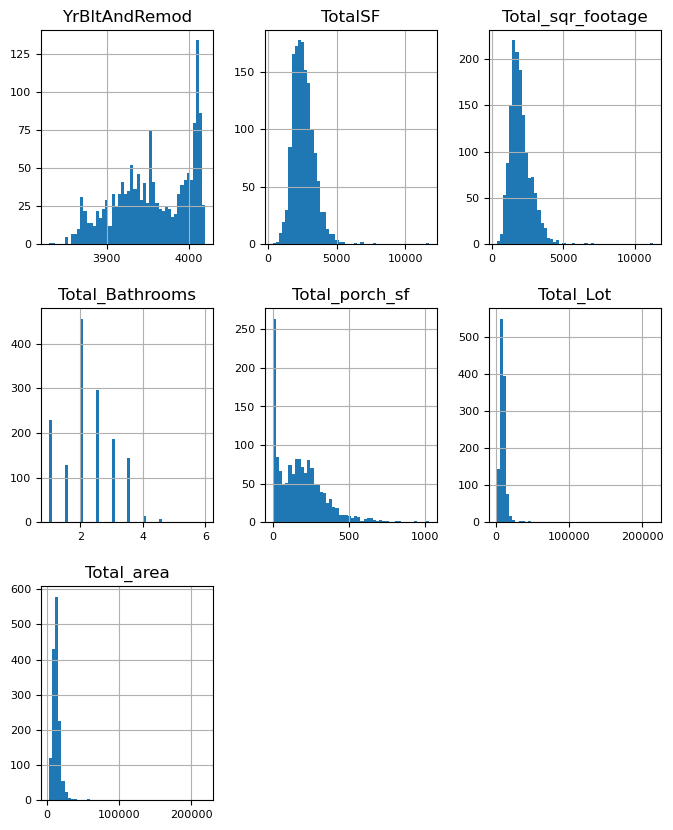
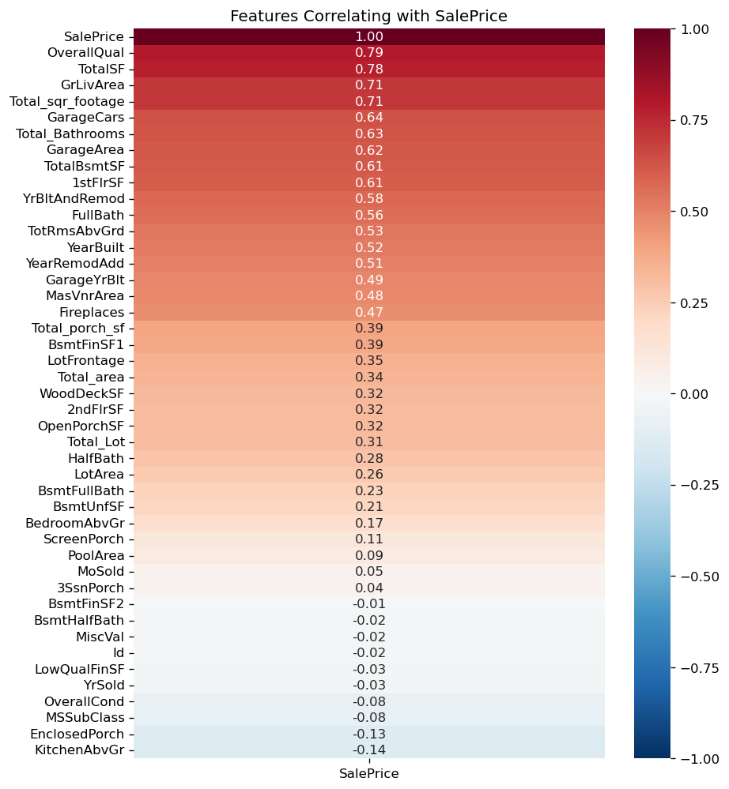
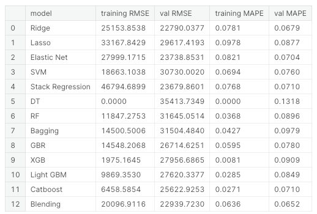
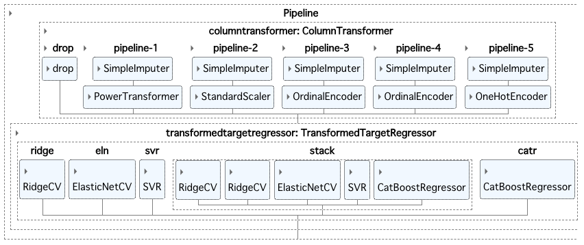
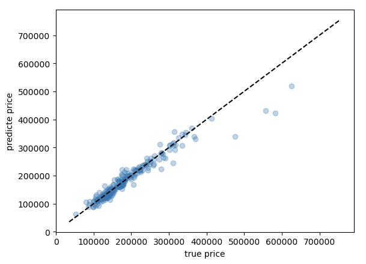

July 30, 2023

# Introduction

This Kaggle competition is to predict house prices in Ames, Iowa, based on various features of the houses. 
The dataset used for this competition was from Kaggle - [House Prices: Advanced Regression Techniques](https://www.kaggle.com/competitions/house-prices-advanced-regression-techniques).

I created an ensemble model which consists of diverse regression algorithms to enhance the predictive performance.

Achievement
- MAPE for test dataset after submission was 0.12069
- Rank: 271/4237 (Top 6% as of July 29, 2023)

# Datasets
- 81 features, including various characteristics of the houses (e.g., number of bedrooms, garage area, etc.)
- Target variable is the sale price of each house
- Total 1,460 rows for training set, 1,459 rows for test set.
- After data cleaning, I removed five features and transformed some features to improve model performance.

To prepare the data for modeling, I performed data cleaning and handled missing values by imputing them appropriately.

# Language and libraries
**Language** : Python

**Libraries** : 
- Data Manipulation: pandas, numpy, scipy itables, pandas_profiling, missingno
- Data Visualization: matplotlib, seaborn
- Machine Learning: sklearn, xgboost, lightgbm, catboost

# Features Observation & Data Preprocessing
- Missing Values (Nan)
1. There are some patterns of missing values in some features, including:
    - GarageYrBlt, GarageType, GarageFinish, GarageQual, GarageCond
    - BsmtExposure, BsmtFinType2
    - BsmtQual, BsmtCond, BsmtFinType1
    - MasVnrArea, MasVnrType
    - LotFrontage
    - Electrical

2. Missing data is prevalent (more than 40%) in several features, which will be dropped in the pipeline, including:
    - PoolQC
    - MiscFeature
    - Alley
    - Fence
    - FireplaceQu

- Ordinal Features
1. With the same scale: Poor (Po), Fair (Fa), Typical (TA), Good (Gd), Excellent (Ex)
2. With different scales

- Numerical Features
1. Log Transformation:  After checking the distribution plots, some features need to be conducted log transformation, including:
    - LotFrontage, LotArea, TotalBsmtSF, 1stFlrSF, GrLivArea

2. Imputation: Some features have more 0 than expected, which will be imputed in the pipeline, including:
    - MasVnrArea, BsmtFinSF1, BsmtFinSF2, 2ndFlrSF, WoodDeckSF, OpenPorchSF, EnclosedPorch, 3SsnPorch, ScreenPorch, PoolArea, MiscVal
3. Pseudo-numerical Features: Some numeric-like features are ordinal, including:
    - MSSubClass, MoSold
4. Log Transformation for y: Target variable needs to be log transformed because of its skewed distribution.

# Feature Engineering
I created a few new features based on domain knowledge to increase model performance.

- YrBltAndRemod
- TotalSF
- Total_sqr_footage
- Total_Bathrooms
- Total_porch_sf
- Total_Lot
- Total_area

# Correlation Heatmap with Targer Variable
I performed EDA to gain insights into the relationships between various features and the target variable (house prices).

Correlation Heatmap with Targer Variable (house prices)

Because all new features are skewed, I decided to use another transformation called **Yeo-Johnson Transforamtion** to improve performance.

# Model Building
* Split Data: 85% training set, 15% validation set 

- Data preprocessing pipeline:
    - Feature pipeline: use pipeline to connect data preprocessing among different features
    - Drop features
    - Features needed to be transformed: Yeo-Johnson transformation
    - Numerical features: standardization 
    - Regular Ordinal features: ordinal encoding
    - Other Ordinal features: ordinal encoding
    - Categorical features: one-hot encoding

 - Model pipeline: After building up feature pipelines, I connected them to the model or algorithms, so I don't need to do the same task again on test data set.

 - Target variable pipeline: I also performed the log transformation for target variable (house prices) in the pipeline.

## Model Selection
After trying a bunch of algorithm, the **Ridge, Elastic Net, Support Vector, Stacking, and Catboost** perform relatively better. 

I then decided to **combine them together** to see if it is possible to achieve better accuracy.

It turns out the model combining all of them performs better than any single model itself, showing on the `Blending` model above.

The diagram of model is as below.

\* Note that lower MAPE means better model performance.

# Evaluation
- Evaluation Metric: MAPE (Mean Absolute Percentage Error)
- The ensemble model achieved an MAPE of 0.0652 on the validation set.
- The plot below shows the model can predict great when there are enough data for housing in similar prices. In other words, the model know more housing cases when the house price is below.

# Potential Future Improvements
- Feature Engineering: Explore additional features or combinations that could better capture the characteristics influencing house prices.
- Hyperparameter Tuning: Fine-tune the hyperparameters of the individual models and the ensemble model to potentially improve their predictive performance further.
- Incorporate Additional Models: Experiment with other powerful **neural network** algorithm to identify potential better-performing models for the ensemble.

# Takeaways
- Ensemble models can often provide better predictive performance by combining the strengths of multiple algorithms.
- Blending an ensemble model can also be beneficial to predictive performance.
- First try to include target variable transformation into pipeline.

# Code
For code detail, you can check [Kaggle here](hhttps://www.kaggle.com/code/cclinnilcc/house-prices-ames-housing/notebook).

