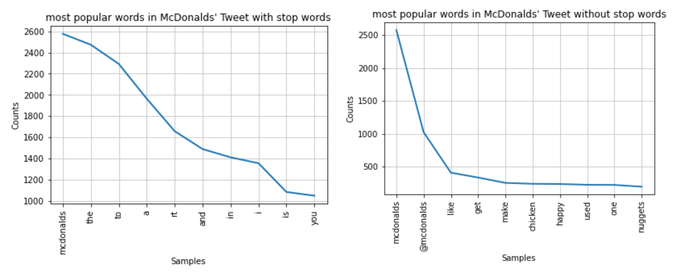
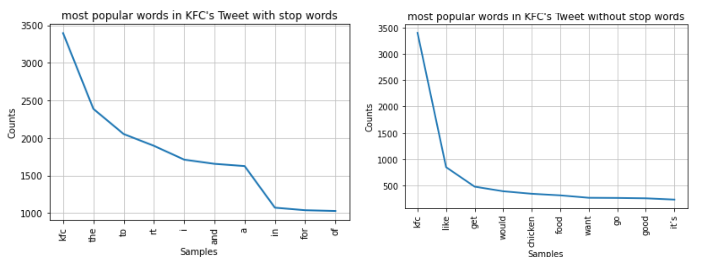
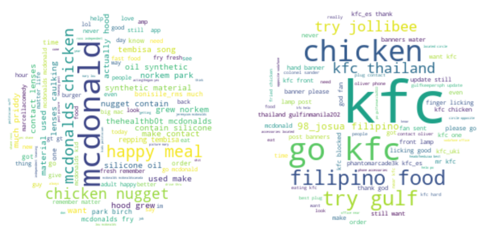

June 24, 2023

# Introduction

The "Twitter Sentiment Analysis" project focuses on the sentiment analysis of tweets related to McDonald's and KFC. It utilizes Python and various libraries to collect tweets, preprocess the data, and determine the sentiment by calculating various metrics. It provides fundamental knowledge and hands-on code for those new to Python and sentiment analysis.

The project code is available on GitHub [here](https://github.com/xup65k6t6/Twitter_Sentiment_Analysis/blob/main/tweet_collection_final%20version.ipynb).

# Language and libraries
**Language** : Python

**Libraries** : 
* Data Collection: tweepy
* Data Manipulation: pandas, numpy
* Data Visualization: matplotlib, WordCloud
* Natural Language Processing: nltk, Counter, TextBlob

# Data Collection

## Tweets
To collect the tweets, the project utilizes the Tweepy library, which provides access to the Twitter API. Users can specify keywords or hashtags to gather relevant tweets. In this project, 5000 tweets were collected for each keyword: "mcdonalds" and "kfc". The tweets were collected in English language only. The data collected spans from October 1, 2022, to October 3, 2022.

## Authors
The project also collected information about the authors of the tweets mentioned above. For McDonald's, there are 4406 unique author IDs, and for KFC, there are 4396 unique author IDs. The project successfully fetched 4390 unique and valid author information for McDonald's and 4373 for KFC. There are a few authors whose IDs were not found, which might be due to the deactivation of their accounts.

Note: Tweepy has a rate limit of 300 author data requests every 15 minutes (as of October 3, 2022). To adhere to this limit, the project includes a sleep function during author data querying.

# Data Cleaning -- Remove URLs and other stop words

The collected tweets undergo preprocessing steps to clean and prepare them for sentiment analysis. The NLTK library is used for tasks such as tokenization, removing stopwords, and stemming. URLs, mentions, and special characters are removed to extract meaningful text for sentiment analysis.

Stop words are the words that are filtered out before or after processing of natural language data (text) because they are insignificant, such as "a", "the", "is", "and", etc. In this project, URLs are also removed, as they may contain references to websites not relevant to the scope of the project. Additionally, some tweets may include "RT" (indicating a retweet).

The most common words before and after removing stopwords for McDonald's and KFC respectively are shown below:

# Preliminary Analysis

To gain initial insights, some preliminary analyses were performed to showcase basic information about the two restaurants.

**Most popular hashtags (#)**

- The hashtag #pakvseng2022 is popular for KFC because, during a recent cricket match between Pakistan and England, KFC pledged to donate Rs 50,000/- to flood-hit victims in Pakistan for every wicket taken by Pakistan.
- The hashtag #georgenotfoundfanart is related to a popular YouTuber who recently went viral, and people have been tagging him in McDonald's-related tweets.

**Most popular usernames (@)**

The most frequently mentioned username for McDonald's is "@McDonalds", indicating that the company actively engages with users on Twitter.

**Trend of tweets count**

# Word Cloud

Before creating the word cloud, lemmatization was applied to transform every word back into its base or dictionary form. This helps reduce the repetition of words in the word cloud graph.

The word clouds for both McDonald's and KFC reveal that people are interested in "happy meals" and "chicken nuggets" for McDonald's, while KFC is known for its "chicken." The word clouds also contain more positive words than negative words for both brands, indicating a generally positive sentiment among users.

# Sentiment Analysis

## Subjectivity Score & Polarity Score

- Subjectivity: a number within the range from 0 to 1 where 0 is very objective and 1 is very subjective.
- Polarity: a number which lies in the range of 0 and 1 where 1 means a positive statement and -1 means a negative statement.

**Average Subjectivity and Polarity scores:** 

**Subjectivity Distribution**

The subjectivity score of McDonald's and KFC is approximately 0.3 which shows that the majority of people tweet facts about the products and the brand rather than their personal opinions.

**Polarity Distribution**

The average polarity score for Mcdonald's is 0.082 and KFC has an average polarity of 0.02, which shows that most people have a neutral sentiment about these two brands. 

The difference in polarity scores is minimal, indicating that more customer reviews are needed to evaluate the performance of each brand.

# Insights

Despite the advancements in technology, people still have a strong affinity for McDonald's and KFC. The word clouds demonstrate that people show interest in McDonald's happy meals and chicken nuggets, as well as KFC's chicken. The presence of more positive words than negative words in both word clouds suggests a generally positive attitude toward the brands.

# Future Improvement
Utilize VADER Sentiment Analysis to deal with unique wording on social media

# Code
The code can be accessed on GitHub [here](https://github.com/xup65k6t6/Twitter_Sentiment_Analysis/blob/main/tweet_collection_final%20version.ipynb) for a detailed understanding of the implementation and further exploration.

