April 3, 2023

# YVR-Energy-Usage-Forecast

# Introduction
The YVR Energy Usage Forecast project aims to forecast energy consumption at the Vancouver International Airport (YVR) using time series modeling techniques. The project utilizes historical energy usage data, weather data, and several time series models to predict hourly energy consumption for future periods.

There are three types of models are tried out in this project: basic forecasting methods, exponential smoothing model (EST), and ARIMA model. The EST (MAA) is the final recommendation based on the model accuracy (lowest MSE) on test data and reasonability of visualized forecasts.

The project uses the following steps:
- Data preprocessing
- Exploratory data analysis (EDA)
- Model selection and validation
- Forecasting

# Datasets
The dataset contains monthly energy usage data of YVR from January 1997 to December 2010.
- Training set: 1997/1 - 2007/12
- Test set: 2008/1 - 2020/12

The dataset contains the following variables:

| \#  | Variable                 | Definition                                                                          |
|:-----------------------|:-----------------------|:-----------------------|
| 1   | month                    | Month and year, e.g.: Nov-98                                                        |
| 2   | energy                   | Energy use measured in thousands of kilowatt hours (kWh)                            |
| 3   | mean.temp                | Mean monthly temperature outside (degrees Celsius)                                  |
| 4   | total.area               | Total area of all terminals (sq. m.)                                                |
| 5   | total.passengers         | Total number of passengers in thousands                                             |
| 6   | domestic.passengers      | Total number of domestic passengers (traveling within Canada) in thousands          |
| 7   | US.passengers            | Total number of passengers traveling between Canada and the US in thousands         |
| 8   | international.passengers | Total number of passengers traveling between YVR and countries other than Canada/US |

# Language and libraries
**Language** : R

**Libraries** : 
- Data Manipulation: dplyr, tidyr, tidyverse
- Data Visualization: corrplot, RColorBrewer
- Statistics: fpp2

# Data Preprocessing
## Check transformation and calendar adjustment
While the seasonality of the data is obvious, which is shown below, it is always better to check if the transformation and calendar adjsutment would be helpful.

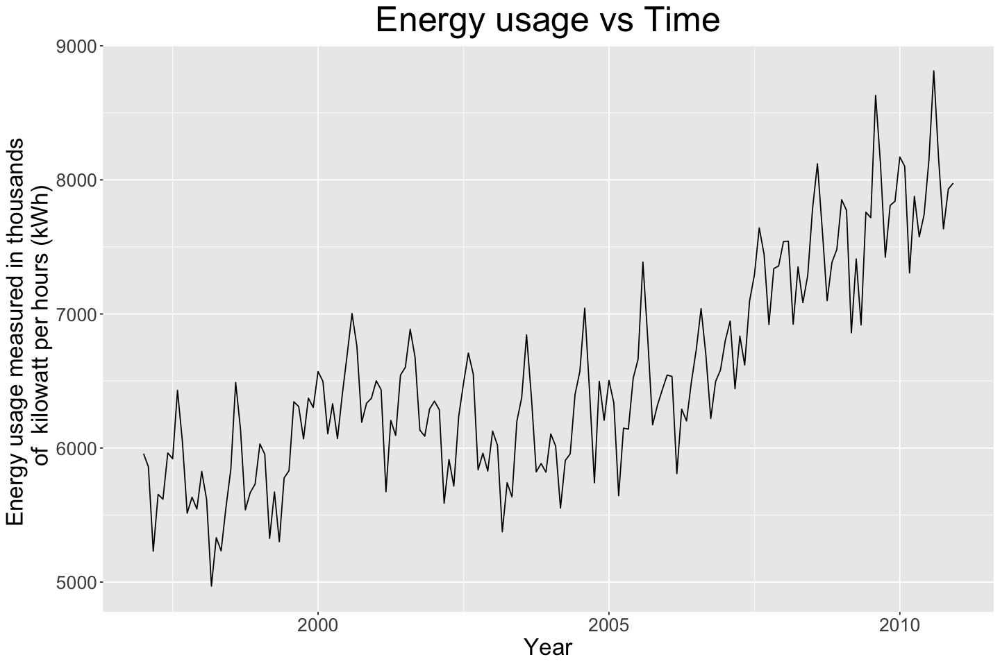

- Box-cox transformation

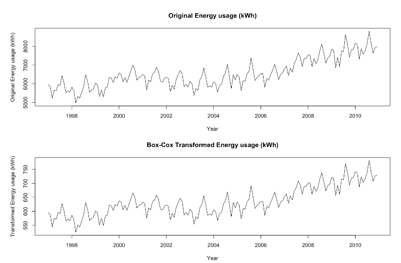

- Calendar adjustment

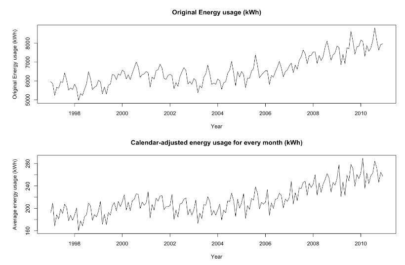

As both transformation and adjustment have no significant help on detecting a trend, there is no need to use them and choose the original data as modeling dataset.

# Exploratory Data Analysis (EDA)
An exploratory data analysis was conducted on the YVR energy data to gain insights into the patterns and trends in the data. This involved visualizing the data using various graphs and statistical measures.

## Key insights:
- Energy usage has an upward trend over time
- There is seasonality with higher usage during the summer months
- The electricity usage has some outliers, but overall it does not affect the result significantly.

## STL decomposition:
This is a statistical method of decomposing a Time Series data into 3 components containing seasonality, trend and residual. This plot can help to access the seasonality, trend, and outliers.

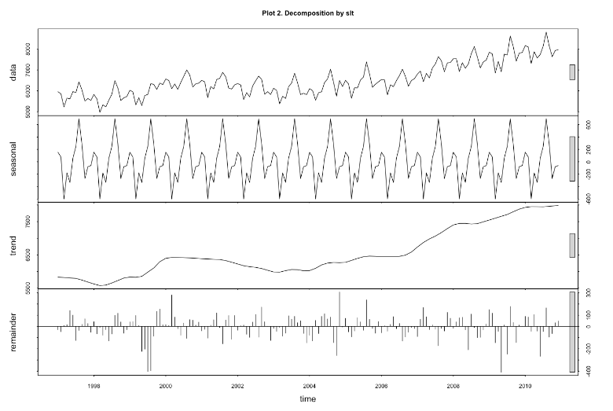

To view the trend more clearly, you can see the plot below.

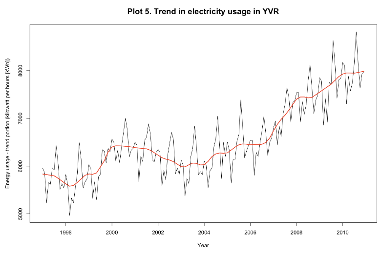

## Check the correlation between features

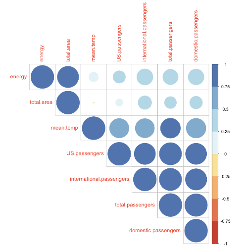

Larger circle means higher correlation. The features related to passengers are all related to each other, meaning that there is no significant difference among passengers.

## Seasonality with higher usage during the summer months

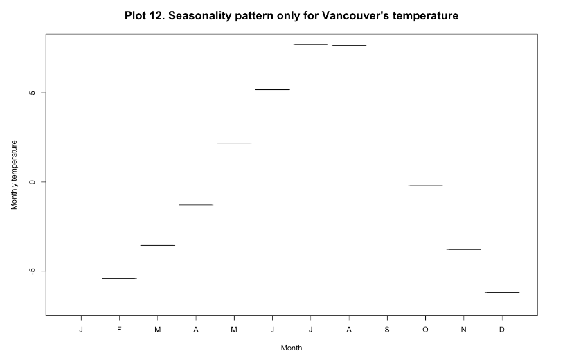

# Model Building
The YVR Energy Usage Forecast project utilized several time series models to forecast energy usage, including: basic forecasting methods (mean, drift, naive, seasonal naive), ETS model, and ARIMA model.

## Basic forecasting methods

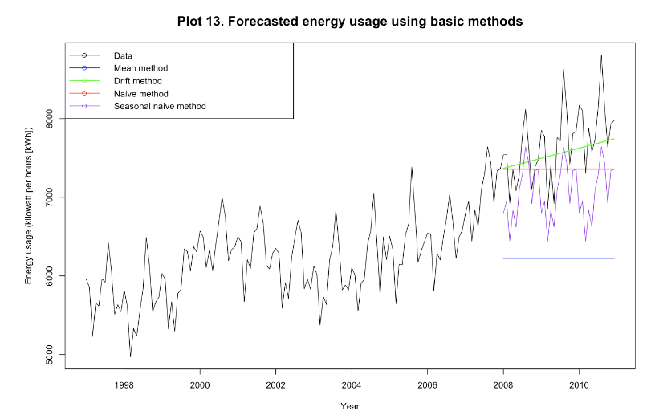

Based on the plot above, the drift method catches the trend and grows with the time passes by, while the seasonal naïve can capture the seasonality pattern in the data. Combining the drift and seasonal naïve would provide a more accurate forecast, and it will be discussed further in later section.

## Exponential Smoothing (ETS MAA)

The original time plot shows that there is seasonality that repeats every 12 months without proportionally increasing seasonality variation over time, indicating that the model should use S = additive. There is a stable trend without expotential growth, indicating that the model should use T = additive and no dampen needed. In the end, using E = multiplicative would be better because the data are strictly positive and because it beats the forecast performance of using additive method.

I also considered other ETS model, and the MAA shows the most optimal performance in terms of four metrics -- RMSE, MAE, MAPE, and MASE. Among all models shown below, ets(A,A,A) shows the best performance of fitting the training dataset in terms of four measures (RMSE, MAE, MAPE, MASE). In the meantime, the selected model ets (M, A, A) has similar measure values as ets(A, A, A) model. As it is likely that ets(A, A, A) overfits the training data set, it is still hard to tell which one will perform the best on the test data set at this stage.

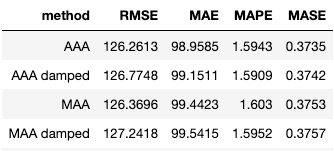

After checking residuals of the model, there is no significant bias.

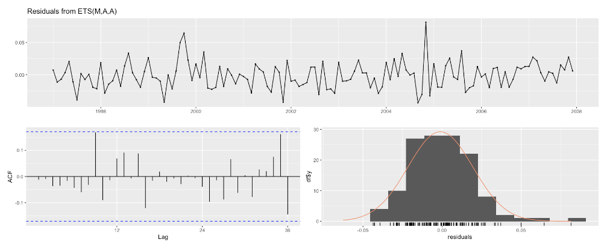

## Auto Regressive Integrated Moving Average (ARIMA (1,1,0)(0,1,1)[12] )

The original time plot shows that there is seasonality that repeats every 12 months (this is the value of m), indicating that we should use D=1 and do seasonal differencing of lag-12. After the seasonal differencing, the series has some trend (Plot 18-A), indicating that we should use d=1 and render the series stationary (Plot 18-B). As including constant when d+D larger than 1 is dangerous, we do not add constant here.

After chekcing the ACF and PACF plot, it seems like ARIMA (1,1,0)(0,1,1)[12] is a good model for this data.

After checking residuals of the model, the mean of residuals is around 9.5, indicating that there is some bais and that there is still some information this model cannot capture.

In the ACF plot, there is one significant autocorrelations at lag-9 and the variance of residuals stays approximately constant through time. According to the histogram plot, the residuals are approximately normally distributed, but there is an outlier which is due to sudden increase of residuals in around 2005.

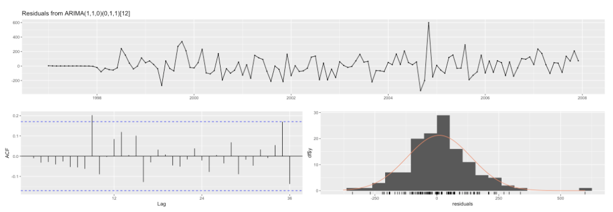

# Evaluation
The performance of the time series models was evaluated using several metrics, including: RMSE, MAE, MAPE, MASE 

# Final Model Selection: ETS (M,A,A)
The best time series model was selected based on the lowest four metrics. The **ETS models** was selected as the best model for forecasting energy usage at YVR.

# Forecasting
The best performing model was used to forecast the energy usage of YVR after 2018. 

It successfully forecasts the energy usage of YVR. 

# Potential future improvement
- Explanatory model
Using explanatory model might be a good model for this forecast problem. Based on the correlation plot above, the number of total passengers, average temperature, and the area of YVR airport may be good explanatory variables because of their high correlation associated with y variable.

# Takeaways
- Clean time series data using transformation and calendar adjustment
- Deploy advanced time series model -- ARIMA model and ETS model

For code detail, you can check [here](https://github.com/xup65k6t6/YVR-Energy-Usage-Forecast).

